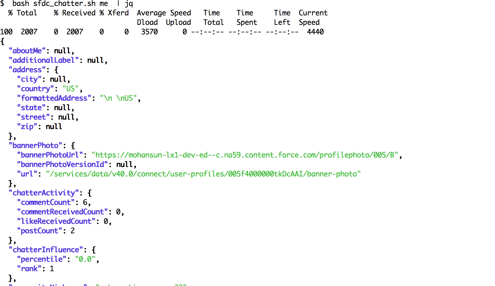
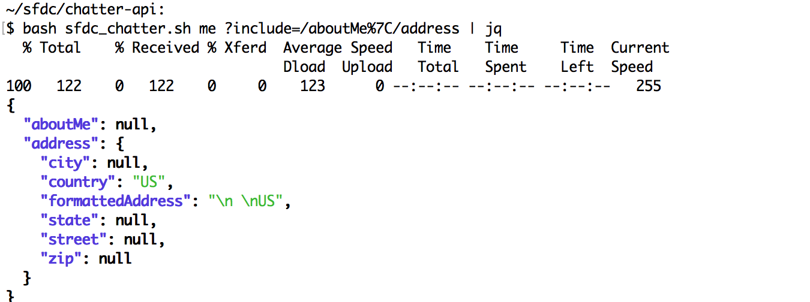
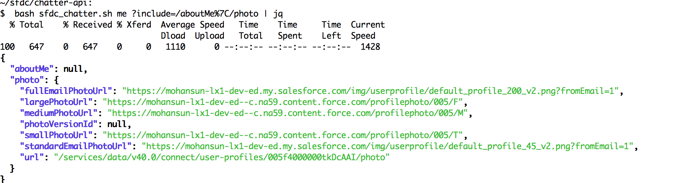
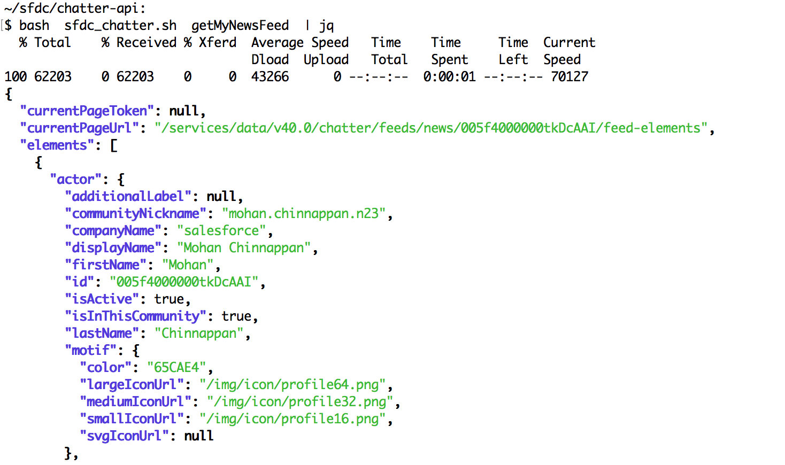
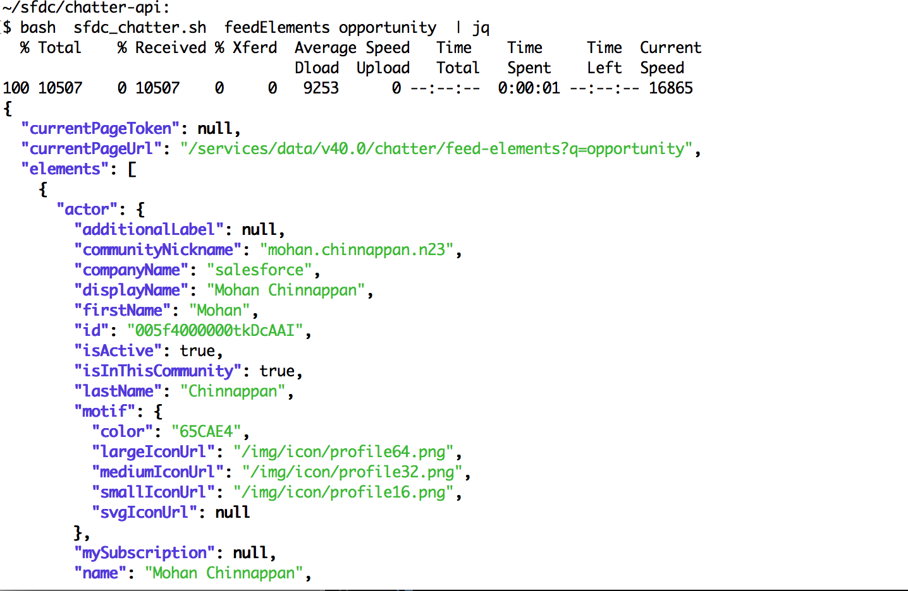
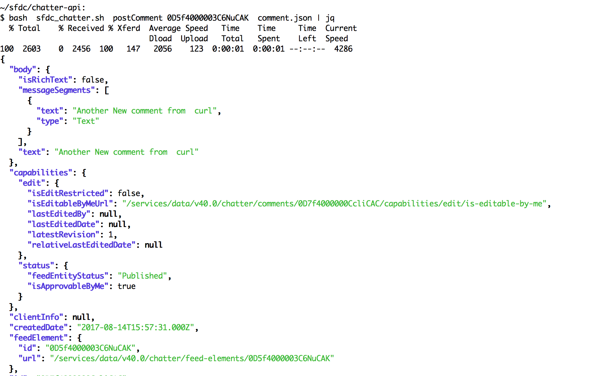
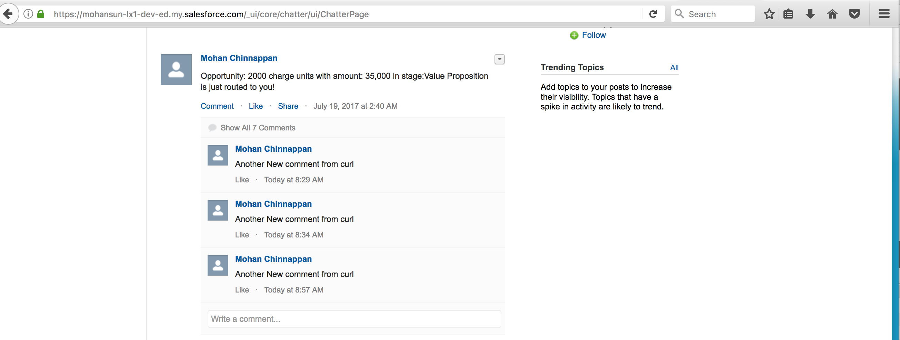

## SFDC Chatter API playground with curl


### bash script

[sfdc_chatter.sh](./sfdc_chatter.sh)

### Steps:

1. Edit the [sfdc_chatter.sh](./sfdc_chatter.sh) to fill in your ACCESS_TOKEN

2. Play with examples shown here


### Examples in action

#### users/me


------
#### Address filter

------
#### Address filter

------
#### getMyNewsFeed
		
------
#### get feed elements for the opportunity

------


#### Post comment

------
#### Data file for posting comment [comments.json](./comment.json)
```json
{
   "body":{
      "messageSegments":[
         {
            "type":"Text",
            "text":"Another New comment from  curl "
         }
      ]
   }
}
```
------
### How it looks in the chatter page


------

### References
1. [Chatter API doc](https://developer.salesforce.com/docs/atlas.en-us.chatterapi.meta/chatterapi/features.htm)
